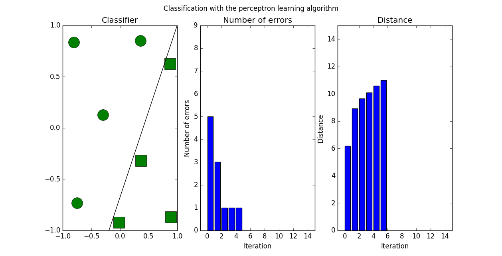
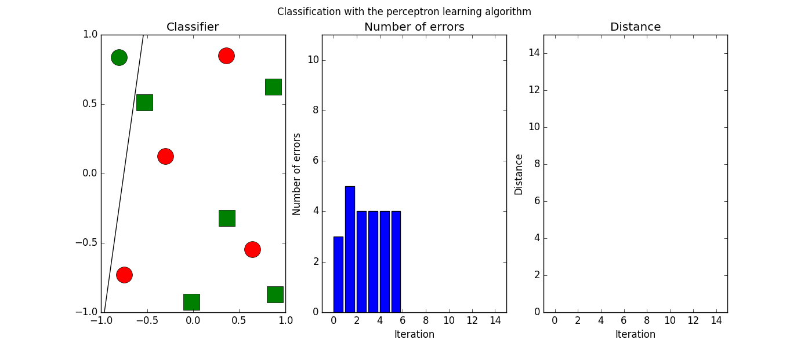
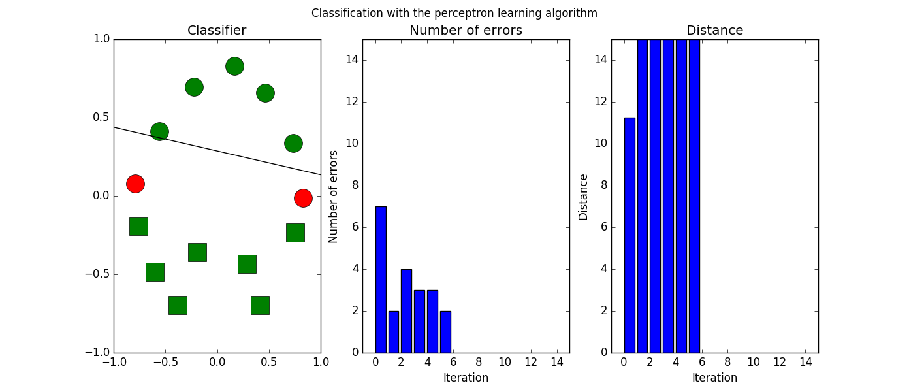

# Neural network for machine learning
Realized the projects of coursera course "Neural Networks for Machine Learning", which was taught by Prof. Geoffrey Hinton.
The code is written by python instead of matlab, which is the default for this course.

### Programming Assignment 1: The perceptron learning algorithm
Reuslt for dataset1:

Reuslt for dataset2:

Reuslt for dataset3:

